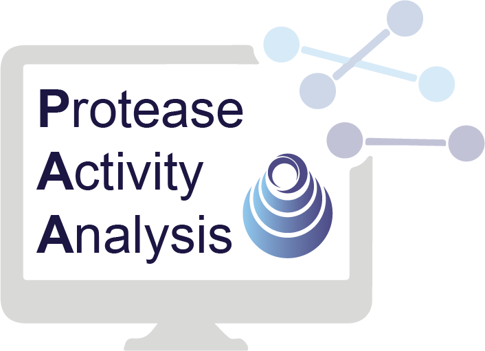

<p align="center" >
  
</p>
<!-- 
<h1 align="center">Protease Activity Analysis</h1>
<h4 align="center">Developed and maintained by: Ava Soleimany, Carmen Martin Alonso, Melodi Anahtar, Cathy Wang, Sangeeta Bhatia</h4> -->

<p align="center"> [<b><a href="">Paper: coming soon!</a></b>] &emsp; [<b><a href="#citation">Citation: coming soon!</a></b>] </p>

# Protease Activity Analysis (PAA)
Analyzing the activity of proteases and their substrates is critical to defining the
biological functions of these enzymes and to designing new diagnostics and therapeutics
that target protease dysregulation in disease.

To facilitate protease research, we present Protease Activity Analysis (PAA). PAA is a Python software package with a collection of tools for analyzing protease activity data. PAA provides a modular framework for streamlined analysis across three major components: 

1. _**Database**_: query and input datasets of synthetic peptide substrates and their cleavage susceptibilities across a diverse set of proteases. 
2. _**Cleavage analysis**_: analyze and visualize enzyme-substrate activity measurements generated through in vitro screens against synthetic peptide substrates. 
3. _**In vivo sensors**_: deploy a set of modular machine learning functions to analyze in vivo protease activity signatures that are generated by activity-based sensors.

The repository accompanies the paper, **Protease Activity Analysis: A Toolkit for Analyzing Enzyme Activity Data in Python**, and is developed and maintained by the paper's authors. If you use code from the repository, please cite the follwoing paper: _coming soon!_.

## Setup
1. Install the following dependencies: [conda 3.x](https://docs.conda.io/en/latest/miniconda.html)
2. [Generate Github SSH keys](https://help.github.com/en/github/authenticating-to-github/generating-a-new-ssh-key-and-adding-it-to-the-ssh-agent). If you already have SSH keys you can first [check to make sure](https://help.github.com/en/github/authenticating-to-github/checking-for-existing-ssh-keys).
3. [Add your SSH key to your Github account](https://help.github.com/en/github/authenticating-to-github/adding-a-new-ssh-key-to-your-github-account).
4. Download this repository: 
```
git clone git@github.com:apsoleimany/protease_activity_analysis.git
```

## Installation
To use the protease activity analysis (paa) toolbox, first create the environment and then install the package:
```
cd protease_activity_analysis
conda env create -f environment.yml
conda activate paa
pip install -e .
```

## Usage
To enter the protease environment: `conda activate paa`

Once inside the environment, the package can be directly imported and used in a Python shell/script: 
```
>>> import protease_activity_analysis as paa
>>> paa.tests.test_installation()
```

To deactivate after you are done: `conda deactivate`

## Getting started
To get started using PAA, we recommend you select a tutorial in the `tutorials` folder that is most aligned with your application of interest. We also provide three template analysis scripts in the root directory:
- `analyze_kinetic.py`: analysis of _in vitro_ screening data;
- `analyze_ms_data.py`: analaysis and visualization of _in vivo_ activity sensor data;
- `classify_ms_data.py`: machine learning classification of _in vivo_ activity sensor data. 

## Citation

If you use the code from the repository, please cite the accompanying [paper]():
```
Coming soon!
```
<!-- @article{soleimany2021evidential,
  title={Evidential Deep Learning for Guided Molecular Property Prediction and Discovery},
  author={Soleimany, Ava P and Amini, Alexander and Goldman, Samuel and Rus, Daniela and Bhatia, Sangeeta and Coley, Connor},
  journal={ACS Central Science},
  year={2021},
  publisher={ACS Publications}
} -->

## Contributing
Code should be written in compliance with the [Google Python style guide](http://google.github.io/styleguide/pyguide.html) with [Google style docstrings](http://queirozf.com/entries/python-docstrings-reference-examples#google-style).

## Contact
Please direct correspondence to Ava Soleimany (<avasoleimany@microsoft.com>).
