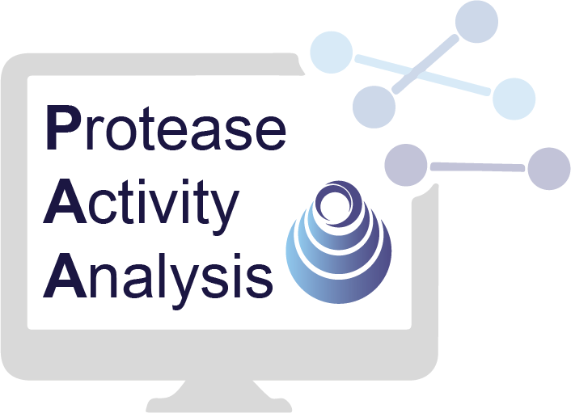

<p align="center" >
  
</p>

# Protease Activity Analysis (PAA)
Analyzing the activity of proteases and their substrates is critical to defining the
biological functions of these enzymes and to designing new diagnostics and therapeutics
that target protease dysregulation in disease.

To facilitate protease research, we present Protease Activity Analysis (PAA). PAA is a software package with a collection of tools for analyzing protease activity data in Python. PAA leverages an object-oriented implementation to provide a modular framework for streamlined analysis across three major components.  

1. PAA provides a facile framework to query datasets of synthetic peptide substrates and their cleavage susceptibilities across a diverse set of proteases. 
2. PAA includes tools for the automated analysis and visualization of user-input enzyme-substrate activity measurements generated through in vitro screens against synthetic peptide substrates. 
3. PAA can be used to analyze in vivo protease activity signatures that are generated by activity-based sensors using a set of modular machine learning functions.


## Setup
1. Install the following dependencies: [conda 3.x](https://docs.conda.io/en/latest/miniconda.html)
2. [Generate Github SSH keys](https://help.github.com/en/github/authenticating-to-github/generating-a-new-ssh-key-and-adding-it-to-the-ssh-agent). If you already have SSH keys you can first [check to make sure](https://help.github.com/en/github/authenticating-to-github/checking-for-existing-ssh-keys).
3. [Add your SSH key to your Github account](https://help.github.com/en/github/authenticating-to-github/adding-a-new-ssh-key-to-your-github-account).
4. Download this repository: 
```
git clone git@github.com:apsoleimany/protease_activity_analysis.git
```


## Installation
To use the protease activity analysis (paa) toolbox, first create the environment and then install the package:
```
cd protease_activity_analysis
conda env create -f environment.yml
conda activate paa
pip install -e .
```

## Usage
To enter the protease environment: `conda activate paa`

Once inside the environment, the package can be directly imported and used in a Python shell/script: 
```
>>> import protease_activity_analysis as paa
>>> paa.tests.test_installation()
```

To deactivate after you are done: `conda deactivate`

## Getting started
To get started using PAA, we recommend you select a tutorial in the `tutorials` folder that is most aligned with your application of interest or running an analysis script located in the root directory. 

## Contributing
Code should be written in compliance with the [Google Python style guide](http://google.github.io/styleguide/pyguide.html) with [Google style docstrings](http://queirozf.com/entries/python-docstrings-reference-examples#google-style).
