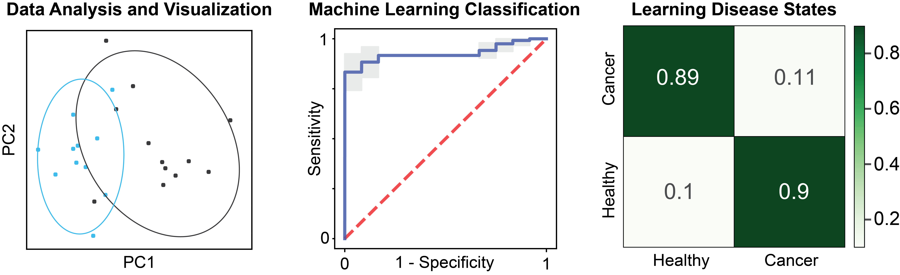

# PAA Tutorials
To get started using PAA, we recommend you select the tutorial that is most aligned with your application of interest. You will need the conda environment installed. From the `protease_activity_analysis/tutorials` directory, launch Jupyter in your browser: `jupyter notebook`. Here you can access and run the tutorial notebooks.

## Database Tutorial
This tutorial describes the PAA `database` functionality. The `SubstrateDatabase` class provides a framework to load and query datasets of protease-substrate activity.

To demo the package, we show how to load and query a rich dataset of 150 unique peptide substrates and their cleavage susceptibility against a diverse set of recombinant proteases, generated in the [Bhatia Lab](https://lmrt.mit.edu). We publish these datasets together with this repository and paper and envision that they will provide a valuable resource for the scientific community.

The `SubstrateDatabase` class enables the:
- Query of protease-substrate activity assay data for proteases, substrates, or sequences of itnerest
- Identification of the substrates present in the database that are most robustly and specifically cleaved by a protease of interest
- Identification of the proteases that robustly and/or specifically cleave a peptide substrate of interest
- Assessment of the degree of similarity between a sequence of interest and sequences in the database
- Assessment of degree of similarity between all substrates in the database
- Search for k-mer motifs across all sequences in the database

  

## Kinetic Analysis Tutorial
This tutorial describes the PAA's functionality for analysis and visualization of _in vitro_ enzyme activity assays, through `kinetic.py`. TThe `KineticDataset` class provides a framework to load and analyze raw data files from _in vitro_ assays generated directly by measurement instruments (e.g., fluorimeters). Additionally, the package supports visualization of inputs from retrospective screens, for which a matrix summarizing cleavage efficiencies across a set of samples may have already been produced.

To demo the package, we show how to load raw files from a retrospective _in vitro_ screen of a panel of lung cancer-associated recombinant proteases against a panel of 14 peptide substrate from the Bhatia Lab [(Kirkpatrick et al., Science Translational Medicine, 2020)](https://www.science.org/doi/10.1126/scitranslmed.aaw0262). 

In this tutorial you will learn how to: 
- Plot and analyze data from each independent fluorogenic run.
- Aggregate summary data outputs form individual runs to generate a matrix of samples of interest vs. peptides of interest.
- Plot aggregated data using relevant visualization tools.

  

## Substrate and Protease Tutorial
This tutorial describes the functionality of the `substrate.py` and `protease.py` modules of the PAA repo:
- `substrate.py`: analysis and visualization of peptide sequences
- `protease.py`: classification and search of proteases

To demo the functionalities of these modules, we show how to create a new instance of the `SubstrateDatabase` and test the different functions on all the substrate sequences in the database.

  

## In Vivo Analysis Tutorial 

This demonstration focuses on analysis of mass-spectrometry data generated by _in vivo_ protease activity sensors, for example those described in [Kirkpatrick, Warren, Soleimany et al., _Science Translational Medicine_ 2020](https://www.science.org/doi/10.1126/scitranslmed.aaw0262). You will see how to: 
1. Convert raw mass spectrometry data into a data matrix that can be used for downstream analysis;
2. Normalize this matrix based on your specifications;
3. Analyze and visualize the relative reporter concentrations;
4. Use the reporter concentrations to train a classifier, perform cross-validation, and test on another dataset.

This data in the demo comes from [Kirkpatrick et al., Science Translational Medicine (2020)](https://www.science.org/doi/10.1126/scitranslmed.aaw0262) and is described in the demonstration.

  

