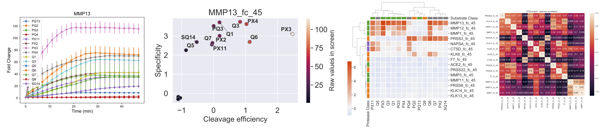
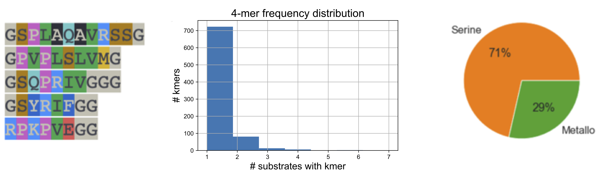

# PAA Tutorials
To get started using PAA, we recommend you select the tutorial that is most aligned with your application of interest. You will need the conda environment installed as well as support to run Jupyter notebooks, for example in your browser or in JupyterLab.

## Database Tutorial
This tutorial describes the functionality of the 'database' subpackage of the PAA repo. The subpackage incorporates the SubstrateDatabase class that provides a framework to load and query datasets of protease-substrate activity.

To demo the package, we show how to load and query a rich dataset of 150 unique peptide substrates and their cleavage susceptibility against a diverse set of recombinant proteases, generated in the Bhatia Lab. All input files required query said datasets are made publically available and should comprise a valuable research for the sceintific community.

The SubstrateDatabase class enables to:
- Query protease-substrate activity assay data for proteases, substrates, or sequences of itnerest
- Identification of the substrates present in the database that are most robustly and specifically cleaved by a protease of interest
- Identification of the proteases that robustly and/or specifically cleave a peptide substrate of interest
- Assessment of the degree of similarity between a sequence of interest and sequences in the database
- Assessment of degree of similarity between all substrates in the database
- Search for k-mer motifs across all sequences in the database

  

## Kinetic Analysis Tutorial
This tutorial describes the functionality of the 'kinetic' subpackage of the PAA repo. The subpackage incorporates the KineticDataset class that provides a framework to load and analyze raw data files from multiplexed fluorogenic assays generated directly by measurement instruments (e.g., fluorimeters). Additionally, the package supports visualization of inputs from retrospective screens, for which a matrix summarizing cleavage efficiencies across a set of samples may have already been produced.

To demo the package, we show how to load raw files from a retrospective in vitro screen of a panel of lung cancer-associated recombinant proteases against a panel of 14 peptide substrate from the Bhatia Lab (Kirkpatrick et al., STM, 2020). 

In this tutorial you will learn how to: 
- Plot and analyze data from each independent fluorogenic run.
- Aggregate summary data outputs form individual runs to generate a matrix of samples of interest vs. peptides of interest.
- Plot aggregated data using relevant visualization tools.

  

## Substrate and Protease Tutorial
This tutorial describes the functionality of the 'substrate' and 'protease' subpackages of the PAA repo.

The 'substrate' package is intended to help analyze and visualize peptide sequences.
The 'protease' package has functions related to classifying proteases by class and finding protease orthologs across species.
To demo the package, we show how to create a new instance of the SubstarteDatabase class in 'database.py' and test the different functions on all the substrate sequences in the database.
<<<<<<< HEAD

## In vivo tutorial 

In this demonstration, you are going to see how to: 1) Convert raw mass spectrometry data into a data matrix that can be used for downstream analysis 2) Normalize this matrix based on your specifications 3) Visualize the relative reporter concentrations using PCA and volcano plots 4) Use the reporter concentrations to train a classifier, perform cross-validation, and test on another dataset

This data comes from Kirkpatrick et al., Science Translational Medicine (2020). The data is from healthy and lung cancer mice that were injected with a 14-plex activity-based nanosensor panel at 5 weeks, 7.5 weeks, and 10.5 weeks after tumor initiation.
=======

  

>>>>>>> 9ddf0455c96e1e0675a0c92a7356ea4146b99815
